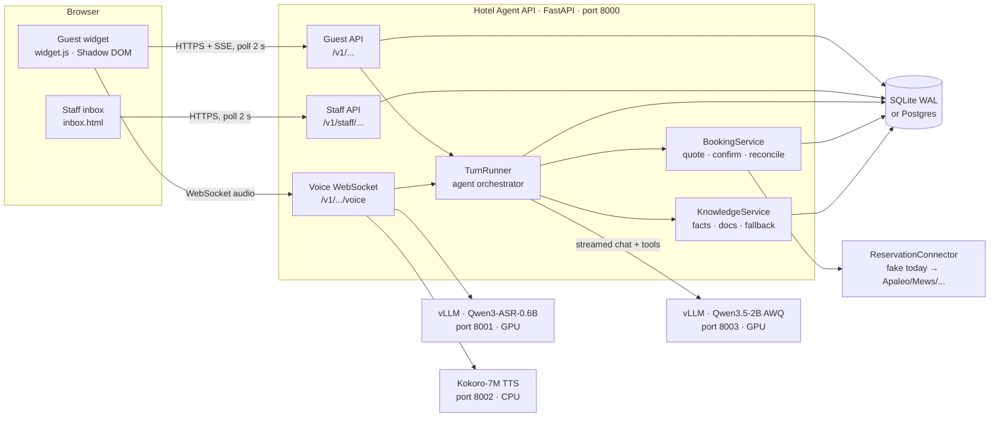
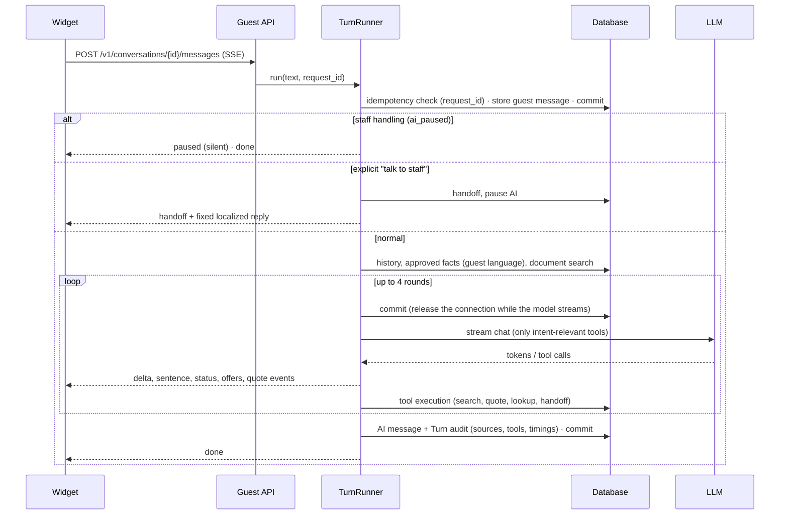
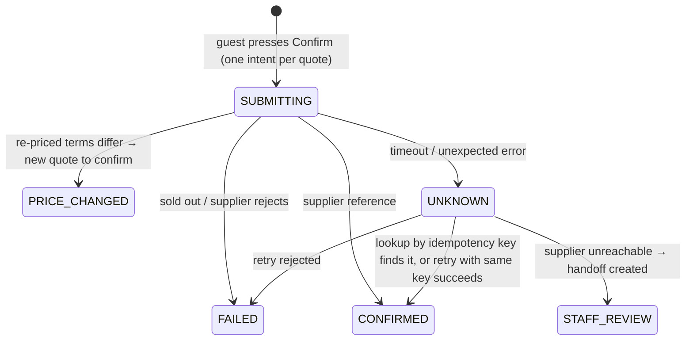

# Hotel Agent — Architecture

A multilingual AI front desk for hotels. It answers guests from hotel-approved information, searches availability, prepares bookings that the guest confirms, talks by voice, and hands conversations to hotel staff. Everything runs locally: FastAPI app, SQLite (Postgres-ready), and three model servers on one 6 GB GPU/CPU.

Status: working demo for one property (Steigenberger ALDAU Beach Hotel, Hurghada). Hotel facts are real (official hotel page). **Availability and prices are simulated** by a fake reservation connector.

---

## 1. System overview



### Processes

| Process | Port | Runs on | Environment | Start script |
|---|---|---|---|---|
| Speech-to-text: vLLM `Qwen/Qwen3-ASR-0.6B` | 8001 | GPU, 46% VRAM (~2.1 GB) | `~/vllm-env` | `scripts/run_asr.sh` |
| Text model: vLLM `cyankiwi/Qwen3.5-2B-AWQ-4bit` | 8003 | GPU, 50% VRAM (~3.1 GB) | `~/vllm-env` | `scripts/run_llm.sh` |
| Text-to-speech: Kokoro-7M (English voice) | 8002 | CPU | `~/kokoro-env` | `scripts/run_tts.sh` |
| Hotel Agent API + web pages | 8000 | CPU | `hotel_agent/.venv` (uv) | `scripts/run_api.sh` |

`scripts/start_stack.sh` starts all four in the order the GPU requires (ASR before the LLM) and writes logs to `.run/*.log`. The API talks to every model server over OpenAI-compatible HTTP, so any server can be swapped by changing `.env` (for example `LLM_BASE_URL` to a cloud provider).

---

## 2. Code map

```
app/
  main.py            App factory: settings checks, DB + pooled HTTP client, routers, static pages
  config.py          Settings from .env (LLM_*, ASR_*, TTS_*, DATABASE_URL, SESSION_SECRET)
  db.py              Async SQLAlchemy engine; SQLite pragmas (WAL, busy_timeout, foreign keys)
  models.py          ORM tables (section 5)
  security.py        HMAC guest tokens, hashed staff API keys
  providers.py       HTTP adapters: stream_chat (tool calls), embed, transcribe, speak
  seed.py            Demo property: Steigenberger ALDAU (facts EN+AR, rooms, children policy)
  api/
    guest.py         Sessions, SSE chat, message polling, booking forms, confirm
    voice.py         WebSocket: audio → ASR → agent → sequenced TTS; barge-in
    staff.py         Inbox, reply, typing, takeover, facts, documents, bookings, simulator faults
    deps.py          Session/auth dependencies, org and property scoping
  agent/
    orchestrator.py  TurnRunner: one guest turn (context → model with tools → audit)
    tools.py         Tool schemas + ToolExecutor; intent gates (booking, human)
    forms.py         Form-driven booking steps that reuse the same tools
    sentences.py     Stream filters: citations, markdown, sentence chunking for voice
    language.py      Language detection, localized fixed replies, noise-transcript check
  booking/
    contracts.py     Offer, Quote, BookingState + legal transitions (Pydantic, Decimal money)
    service.py       Quote → confirm → submit → reconcile, effect ledger, idempotency
    registry.py      Picks the connector for a property
    connectors/      base.py (Protocol), fake.py (simulated inventory + fault injection)
  knowledge/
    service.py       Approved facts per language; document chunks; keyword/embedding search
    fallback.py      Model-down answers from approved facts; small talk
  voice/pipeline.py  SequencedSpeaker: parallel TTS, strictly ordered playback
  web/               widget.js, demo.html (landing page), inbox.html
services/kokoro/     Kokoro TTS server (runs in its own venv)
scripts/             run_*.sh, start_stack.sh, smoke tests, bench_models.py, load_test.py, stub_llm.py
tests/               64 tests: booking, agent loop, isolation, voice, forms, fallbacks, migrations
migrations/          Alembic
```

### API

| Method | Path | Who | Purpose |
|---|---|---|---|
| GET | `/v1/properties/{slug}/widget-config` | public | Hotel name, languages, currency |
| POST | `/v1/properties/{slug}/sessions` | public | Start a conversation; returns a guest token |
| POST | `/v1/conversations/{id}/messages` | guest | Chat turn, streamed as SSE events |
| GET | `/v1/conversations/{id}/messages?after=` | guest | Polling: new messages, `ai_paused`, `staff_typing` |
| POST | `/v1/conversations/{id}/availability` | guest | Booking form step 1: dates and guests → offers |
| POST | `/v1/conversations/{id}/quotes` | guest | Booking form step 2: offer and guest details → quote |
| POST | `/v1/conversations/{id}/bookings/confirm` | guest | The only way to book |
| WS | `/v1/conversations/{id}/voice?token=` | guest | Voice conversation |
| GET | `/v1/staff/properties` | staff | Properties of the key's organization |
| GET | `/v1/staff/properties/{slug}/conversations` | staff | Inbox list |
| GET | `/v1/staff/conversations/{id}` | staff | Thread with per-turn audit |
| POST | `/v1/staff/conversations/{id}/reply` | staff | Reply (pauses the AI) |
| POST | `/v1/staff/conversations/{id}/typing` | staff | Typing indicator |
| POST | `/v1/staff/conversations/{id}/takeover` | staff | Pause or resume the AI |
| GET/PUT | `/v1/staff/properties/{slug}/facts[/{key}]` | staff | Approved facts per language |
| POST | `/v1/staff/properties/{slug}/documents` | staff | Upload knowledge text |
| GET | `/v1/staff/properties/{slug}/bookings` | staff | Booking intents and states |
| POST | `/v1/staff/properties/{slug}/simulator/faults` | staff (dev) | Inject supplier failures |

---

## 3. Key flows

### 3.1 Text chat turn



Design points:
- **One model call per turn when possible.** Approved facts are in the system prompt, so FAQ answers need no tool round trip.
- **Tools are gated by intent.** Booking tools are offered only on booking intent (words or dates) or ongoing booking context; handoff only on a request for a person. This keeps small models from calling search for "is parking free?" and shortens the prompt.
- **The loop always ends in words.** The last round has no tools, a repeated failing call disables tools, and an empty answer gets one retry.
- **Streaming filters.** Citation markers (`[F:check_in]`) and markdown are removed before the guest sees or hears text. Citations are kept for the audit.
- **Model unavailable.** Replies come from approved facts matched by multilingual keywords, or small-talk templates. A request for staff still hands off. Anything else gets an honest "our team can help" message.
- **Language.** The language of the message wins over the widget's UI language. Fixed replies (quote ready, handoff, errors) are localized templates, not model text.

### 3.2 Booking

Two entry points share the same validated tool code:
- **Forms (preferred):** the widget's date and guests form calls `POST /availability`, and the guest-details form calls `POST /quotes`. No model is involved, so a small model's mistakes (dates, names) can't corrupt a booking. The steps are written to history as tool calls, so the model stays consistent afterwards.
- **Chat:** the model calls `search_availability` and `prepare_booking`. It can only quote offers that appeared in this conversation.

Only an explicit guest action books: `POST /bookings/confirm` with a `quote_id`. There is no confirm tool for the model.



Every external attempt is written to the `effects` ledger. Money is `Decimal`. A terms hash covers price, dates, occupancy, meals, payment, cancellation, and guest, so any change forces reconfirmation.

### 3.3 Voice (sequenced streaming)

1. The browser runs voice activity detection with a pre-roll, and sends 16 kHz WAV plus `{utterance_end, language}` over the WebSocket.
2. ASR transcribes with the guest's language as a hint. Implausible transcripts (noise producing Thai or Chinese, too short) are rejected. They never cancel an answer in progress.
3. The agent streams. The first sentence may be cut at a clause boundary to start speaking sooner.
4. `SequencedSpeaker` synthesizes up to 2 sentences in parallel and sends audio strictly in order. The browser schedules it gaplessly.
5. Barge-in: the browser lowers the agent's voice immediately. The server cancels the answer only when real speech is confirmed.

Measured on this machine: about 1.8–2.0 s from the end of speech to the first audio.

### 3.4 Staff handoff and live updates

- The widget polls `GET /messages?after=` every 2 s for staff replies and the `staff_typing` flag.
- The inbox polls every 2 s and sends `POST /typing` while staff type (at most every 2 s; it expires after 5 s).
- A staff reply or "Take over" pauses the AI. While paused, guest messages go to the inbox silently. "Resume AI" hands the conversation back.

---

## 4. Integration points ("plug into any system")

| Side | Interface | Today | Planned |
|---|---|---|---|
| Reservation system | `ReservationConnector` Protocol (`search`, `price`, `book`, `find_by_idempotency_key`, `lookup`) with declared capabilities | Fake connector with fault injection | Apaleo, Mews/Cloudbeds, SiteMinder MCP |
| Guest channels | Guest REST + SSE, voice WebSocket, embeddable widget (one `<script>`) | Web widget, voice | WhatsApp, email, OTA messages |
| Staff | Staff REST API (org API key) | Built-in inbox | Zendesk/Intercom handoff connector, OIDC login |
| Models | OpenAI-compatible HTTP (`LLM_*`, `ASR_*`, `TTS_*`) | Local vLLM + Kokoro | Any hosted provider; per-language TTS voices |
| Other AI agents | — | — | Own MCP server exposing search/quote/lookup |

Tools offered to the model are generated from connector capabilities, so a connector without `BOOK` never offers booking.

---

## 5. Data model

| Table | Purpose |
|---|---|
| `organizations` | Hotel group; hashed staff API key |
| `properties` | Hotel: slug, timezone, currency, languages, connector config |
| `hotel_facts` | Approved facts per `(property, key, language)`; the primary knowledge source |
| `knowledge_chunks` | Uploaded documents, split by paragraph; optional embeddings |
| `conversations` | Guest conversation: channel, language, status, `ai_paused` |
| `messages` | Guest/AI/staff/system messages; `meta` holds offers, quote ids, tool traces, errors |
| `turns` | Audit per AI turn: request id (idempotency), sources, tools, timings, model |
| `quotes` | Quoted terms (JSON), terms hash, expiry, superseded-by |
| `booking_intents` | One per quote (unique): state, idempotency key, external reference |
| `effects` | Ledger of every supplier call attempt and outcome |
| `handoffs` | Requests for staff with reason and status |

Every business row carries `property_id`; every query filters on it. Guest tokens are bound to one property and one conversation. Staff keys only see their organization's properties.

---

## 6. Security and safety

- Model output is data. The model cannot book, cannot quote offers it never saw, and cannot change permissions. Tool arguments are validated with Pydantic.
- Guest tokens: HMAC-signed and expiring. Staff keys: stored as SHA-256 hashes. The app refuses to start with an empty `SESSION_SECRET`.
- Provider errors are logged with their HTTP status (never keys), and staff see them in the audit.
- Card data never enters chat. Payment would use the reservation system's hosted flow once a real connector exists.

Not yet done: Postgres row-level security (isolation is enforced in queries and tests), rate limiting, OIDC staff login.

---

## 7. Scalability assessment

### Verdict

**The design scales; this deployment does not yet.** The core choices are the ones that scale horizontally:
- a stateless request path;
- tenant-scoped data;
- idempotent turns and bookings;
- model servers behind HTTP;
- streaming without holding database connections.

Three things prevent running more than one API instance or more than a few hundred open chats today:
1. SQLite.
2. Process-local state: the typing indicator and the fake connector's inventory.
3. 2-second polling.

The biggest hard limit is **model capacity** on a single 6 GB GPU.

### Measured (2026-09-28, this machine: 4 CPU cores, RTX 3060 Laptop 6 GB, WSL 7.9 GB RAM)

**Real stack**, FAQ questions, each guest asking in sequence (`scripts/load_test.py chat`):

| Concurrent guests | First text p50 | First text p95 | Full reply p95 | Replies/s | Errors |
|---|---|---|---|---|---|
| 1 | 0.12 s | 0.49 s | 0.70 s | 2.2 | 0 |
| 4 | 0.34 s | 0.54 s | 0.95 s | 4.7 | 0 |
| 8 | 0.58 s | 1.18 s | 1.92 s | 6.5 | 0 |
| 16 | 1.61 s | 1.90 s | 2.37 s | 6.9 | 0 |
| 32 | 3.55 s | 5.52 s | 6.06 s | 6.0 | 0 |

The LLM saturates at about 7 replies/s (vLLM `--max-num-seqs 4`, limited by VRAM). Quality holds; waiting grows linearly past about 8 simultaneous guests.

**App layer alone**, with a stub model (0.3 s to first token, 60 tokens/s, `scripts/stub_llm.py`):

| Concurrent guests | Before fixes: first p50 / replies/s | After fixes: first p50 / replies/s |
|---|---|---|
| 10 | 0.51 s / 7.2 | 0.54 s / 8.2 |
| 50 | 2.56 s / 11.7 | 1.04 s / 18.3 |
| 100 | 4.71 s / 11.7 | 1.93 s / 21.1 |

Two bottlenecks were found and fixed during this assessment:
1. **A DB connection was held for the whole model stream.** That capped concurrent conversations at the pool size (15). The turn now commits before every model call.
2. **SQLite rollback journal:** every write blocked all readers. WAL mode is now on.

The remaining ceiling (about 21 replies/s at ~70% CPU) is one Python process plus SQLite's single writer.

**Polling**, simulated open widgets, each polling every 2 s:

| Open widgets | Requests/s served | p50 | p95 |
|---|---|---|---|
| 100 | 45 | 8 ms | 13 ms |
| 300 | 136 | 9 ms | 135 ms |
| 600 | 73 | 5.4 s | 18 s |
| 1000 | 78 | 8.5 s | 25 s |

One process serves about 140 polls/s, so the current design supports **about 300 open chat windows**.

**Voice**, 8 requests at once:

| | 1 at once | 4 at once | 8 at once |
|---|---|---|---|
| TTS (Kokoro, CPU, serialized) | 0.76 s | 2.85 s | 5.08 s |
| ASR (vLLM, GPU) | 2.15 s | 2.12 s | 3.61 s |

TTS handles one sentence at a time (about 0.65 s each), so voice comfortably supports **2–3 guests speaking at the same moment**.

### Capacity today

| Resource | Comfortable | Limit observed |
|---|---|---|
| Simultaneous chatting guests (local 2B model) | ~8 (sub-second first text) | ~7 replies/s |
| Open chat windows (polling) | ~300 | ~140 polls/s |
| Simultaneous voice speakers | 2–3 | TTS serialized |
| Properties / organizations | Many (data model is multi-tenant) | — |

A 400-suite resort at high occupancy rarely has more than a handful of guests typing at the same second. So this setup is realistic for **one property**, with voice as the first thing to feel slow.

### Bottlenecks, ranked, and the fix for each

| # | Bottleneck | Why it limits | Fix |
|---|---|---|---|
| 1 | LLM throughput (one 6 GB GPU) | ~7 replies/s | Bigger GPU (24 GB: larger batch and model), more vLLM replicas behind a load balancer, or a hosted model via `LLM_BASE_URL`. No code change needed. |
| 2 | TTS serialized on CPU | 2–3 voice speakers | Run Kokoro on GPU or several TTS workers; cache fixed phrases; add Arabic voices. |
| 3 | 2 s polling | ~300 open widgets per process | Push instead of poll: one SSE/WebSocket per open widget, driven by Postgres `LISTEN/NOTIFY` or Redis pub/sub. Or poll 2 s only while staff are active and 10–15 s when idle. |
| 4 | SQLite single writer | ~21 replies/s, one API process | Postgres (asyncpg is already a dependency; Alembic migrations exist). Then run several API workers or instances. |
| 5 | Process-local state | Blocks multiple API instances | Move the typing indicator to Postgres/Redis with TTL. The fake connector is demo-only; real connectors keep state in the PMS. |
| 6 | Per-turn knowledge load | Reads all facts and chunks per turn (fine for hundreds; slow for thousands of documents) | Cache facts per property and version; pgvector plus full-text search in Postgres. |
| 7 | No rate limiting | One client can exhaust model capacity | Per-IP/session limits on session creation and messages; a queue with "busy" feedback. |

### Scaling path

| Stage | Load | Changes |
|---|---|---|
| Now | 1 property, demo | Current stack (WAL SQLite, 1 process, local 2B model) |
| Pilot | 1–5 properties | Postgres; hosted or larger LLM; TTS on GPU; rate limits |
| Multi-hotel | 10–100 properties | 2+ API instances behind a load balancer; shared typing/pub-sub (Redis or Postgres); SSE push instead of polling; vLLM replicas |
| Large | 100+ properties | Per-region deployments; queue-based LLM gateway with per-tenant quotas; RLS; observability (OpenTelemetry, per-tenant latency SLOs) |

The code paths that matter for scale are already stateless, idempotent, and tenant-scoped, so moving between stages is mostly infrastructure and configuration, not a rewrite.

---

## 8. Testing and tooling

| Command | What it checks |
|---|---|
| `uv run pytest` | 64 tests: booking state machine and faults, agent tool loop, tenant isolation, voice pipeline order and noise handling, forms, fallbacks, migrations |
| `uv run python scripts/smoke_live.py --voice` | Real models end to end (chat, booking, Arabic, voice latency) |
| `uv run --with playwright python scripts/smoke_ui.py .run/shots` | Browser: forms booking, staff typing, staff reply, mobile |
| `uv run python scripts/load_test.py chat\|poll` | Concurrency and latency (section 7) |
| `uv run python scripts/bench_models.py <model>` | Model first-token latency, tool calls, Arabic answers |
