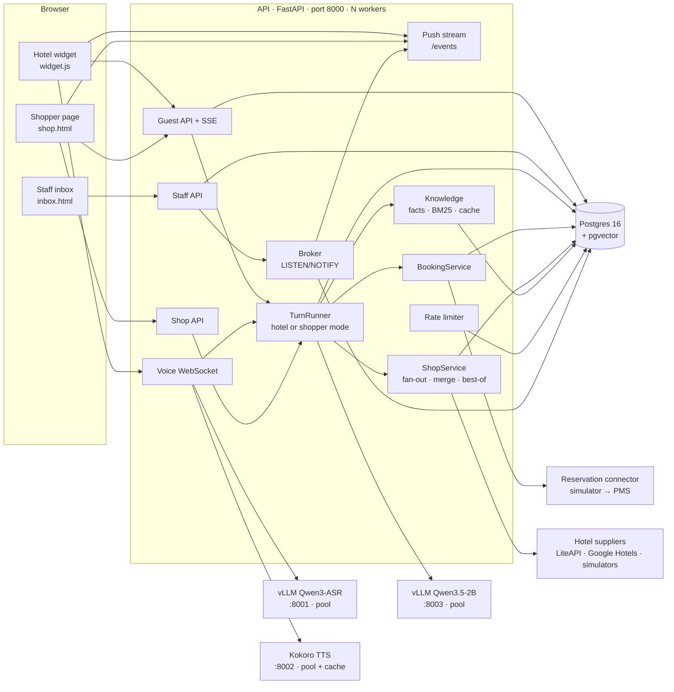
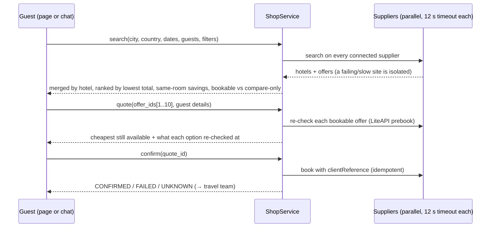

# Hotel Agent — Architecture

Two AI products on one platform:

1. **Hotel front desk** — a hotel's own multilingual agent. It answers from hotel-approved facts and a local area guide, searches availability, prepares bookings the guest confirms, talks by voice, and hands off to staff. Demo: Steigenberger ALDAU Beach Hotel, Hurghada (real facts from the official page; **availability and prices simulated**).
2. **Travel shopper** — a travel agent that searches many booking sources at once for the lowest price and can book the cheapest of several options the guest picks. Demo brand: Answerly Travel (simulated sites with fictional hotels; real sources connect with API keys).

Everything runs locally: FastAPI app (several workers), Postgres 16, and three model servers on one 6 GB GPU plus CPU.

---

## 1. System overview



### Processes

| Process | Port | Runs on | Start |
|---|---|---|---|
| Postgres 16 + pgvector (via `pgserver`, no system install) | Unix socket in `.run/pgdata` | CPU | `uv run python scripts/postgres.py` |
| Speech-to-text: vLLM `Qwen/Qwen3-ASR-0.6B` | 8001 | GPU, 46% (~2.1 GB) | `scripts/run_asr.sh` (start first) |
| Text model: vLLM `cyankiwi/Qwen3.5-2B-AWQ-4bit` | 8003 | GPU, 50% (~3.1 GB) | `scripts/run_llm.sh` |
| Text-to-speech: Kokoro-7M (English voice, CPU PyTorch) | 8002 (+ more with `TTS_WORKERS`) | CPU | `scripts/run_tts.sh` |
| API + pages (`/`, `/shop`, `/inbox`, `/docs`) | 8000 | CPU, `WORKERS=2` | `scripts/run_api.sh` |

`scripts/start_stack.sh` starts everything in the required order and migrates the database. SQLite still works for a single process (`DATABASE_URL=sqlite+aiosqlite:///...`); several workers require Postgres.

---

## 2. Code map

```
app/
  main.py            App factory: startup lock, DB, broker, limiter, model pools, supplier registry, routes
  config.py          Settings (.env): DB, LLM/ASR/TTS (+ *_BASE_URLS pools), rate limits, suppliers
  db.py              Async SQLAlchemy engine (SQLite WAL pragmas / Postgres)
  models.py          All tables (section 5)
  realtime.py        Broker: in-memory or Postgres LISTEN/NOTIFY (push across workers)
  ratelimit.py       Fixed-window limits: Postgres UPSERT (shared) or in-memory
  providers.py       Model clients: endpoint pools with failover, streamed tool calls, TTS LRU cache
  security.py        HMAC guest tokens, hashed staff keys
  seed.py            Demo hotel (facts EN+AR, rooms, children policy, area guide) + Answerly Travel
  api/
    guest.py         Sessions, SSE chat, polling fallback, push stream /events, hotel booking forms
    shop.py          Travel shopper: supplier status, search, best-of quote, confirm
    voice.py         WebSocket: audio → ASR (language hint) → agent → sequenced TTS; noise-safe barge-in
    staff.py         Inbox, reply, typing, takeover, facts, documents, bookings, simulator faults
  agent/
    orchestrator.py  TurnRunner: context → model with tools → guards → audit; hotel or shopper mode
    tools.py         Hotel tools + intent gates + guest-details provenance check
    forms.py         Hotel booking forms reusing the tools
    sentences.py     Stream filters: citations, markdown, sentence chunking, RepetitionGuard, dedupe
    language.py      Detection, localized fixed replies, noise-transcript check
  booking/           Hotel booking: contracts, state machine, service, connectors (simulator: DB-backed)
  knowledge/
    service.py       Facts + documents; cache per (database, property, knowledge_version); RRF with embeddings
    bm25.py          BM25 with Arabic normalization, coverage bonus, relevance gates
    fallback.py      Model-down answers from facts; small talk; unsupported "free" claim check
  shopper/
    contracts.py     StaySearch, SupplierOffer, HotelResult, Recheck, ShopTerms (Decimal, city aliases)
    service.py       Parallel fan-out, merge, rank, same-room savings, best-of re-check, idempotent confirm
    tools.py         Shopper prompt + tools (search_stays, compare_prices, prepare_booking)
    registry.py      Which suppliers are active; status for the page
    suppliers/       liteapi.py (bookable), google_hotels.py (SerpApi, compare-only), simulated.py
  voice/pipeline.py  SequencedSpeaker: parallel TTS, strictly ordered audio
  web/               widget.js, demo.html, shop.html, inbox.html
data/area_guide/     20 Wikipedia articles (EN+AR, CC BY-SA) = area knowledge + RAG test corpus
data/rag_eval.json   28 retrieval questions with exact expected phrases
scripts/             run_*.sh, start_stack.sh, postgres.py, fetch_area_guide.py, rag_eval.py,
                     load_test.py (chat | poll | live), stub_llm.py, bench_models.py, smoke tests
tests/               104 tests; pass on SQLite and on Postgres (TEST_POSTGRES_URL)
```

### API

| Method | Path | Who | Purpose |
|---|---|---|---|
| GET | `/v1/properties/{slug}/widget-config` | public | Name, languages, currency |
| POST | `/v1/properties/{slug}/sessions` | public (rate-limited per IP) | Start a conversation; guest token |
| POST | `/v1/conversations/{id}/messages` | guest (rate-limited) | Chat turn, SSE events |
| GET | `/v1/conversations/{id}/events?token=` | guest | **Push stream**: staff replies, typing, AI paused |
| GET | `/v1/conversations/{id}/messages?after=` | guest | Polling fallback |
| POST | `/v1/conversations/{id}/availability`, `/quotes`, `/bookings/confirm` | guest | Hotel booking forms; confirm is the only way to book |
| GET | `/v1/properties/{slug}/shop/suppliers` | public | Shopper: connected / simulated / not connected sources |
| POST | `/v1/conversations/{id}/shop/search` | guest | Shopper: fan-out search, ranked results |
| POST | `/v1/conversations/{id}/shop/quote` | guest | Re-check 1..10 offers, keep the cheapest available |
| POST | `/v1/conversations/{id}/shop/confirm` | guest | Book the quote (idempotent) |
| WS | `/v1/conversations/{id}/voice?token=` | guest | Voice conversation |
| … | `/v1/staff/...` | staff key | Inbox, reply, typing, takeover, facts, documents, bookings, faults |

---

## 3. Key flows

### 3.1 Agent turn (both modes)

1. Idempotency check (`request_id`); store the guest message; commit.
2. **Paused** (staff handling): stay silent to the guest; the message reaches the inbox.
3. **Explicit request for a person**: hand off immediately, no model.
4. Load context: history, approved facts (cached), and area documents, but **only when no approved fact already answers the question**, and only passages that pass the relevance gates.
5. Model call with **intent-gated tools**, releasing the DB connection while streaming. At most 4 rounds; the last round has no tools, so the model must answer.
6. Stream guards:
   - the repetition guard stops loops;
   - citations and markdown are stripped;
   - sentences are de-duplicated before speaking.
7. Post-guards:
   - an unsupported "free / included" claim is replaced by the approved fact;
   - the model has to use guest details (name and email) the guest actually typed;
   - fixed localized replies after a quote or a handoff.
8. Audit: sources, tools, timings, model, errors (with provider HTTP status).
9. If the model is unavailable, the fallback answers from approved facts, small talk, or a handoff.

### 3.2 Hotel booking

- The form path or the chat path both go through the same validated tools. Only the guest's Confirm books.
- State machine: SUBMITTING → CONFIRMED / FAILED / PRICE_CHANGED / UNKNOWN → reconcile (lookup by idempotency key, retry with the same key) → STAFF_REVIEW.
- The simulator's inventory lives in the database with an advisory lock, so several workers can't sell the last room twice (tested with 5 parallel confirms).

### 3.3 Travel shopper



| Source | Kind | How to enable |
|---|---|---|
| LiteAPI (2M+ hotels) | Bookable; sandbox books without charging | `LITEAPI_KEY` (free sandbox key) |
| Google Hotels via SerpApi: Booking.com, Expedia, Hotels.com and more | Compare-only; the guest continues on the site | `SERPAPI_KEY` |
| SimStay, DemoTrip, MockBooker, PriceWatch | Simulated, fictional hotels | on by default (`SHOP_SIMULATED_SUPPLIERS`) |
| Booking.com Demand, Expedia Rapid | Bookable | require partner approval (not implemented) |

We never scrape OTA websites; their terms forbid it. Amadeus Self-Service was shut down in July 2026.

### 3.4 Voice

Browser voice detection (pre-roll, 650 ms silence) → WAV plus language hint → ASR. The first sentence can be cut at a clause for speed. Sentences are synthesized in parallel and played strictly in order; repeated sentences come from the TTS cache. On barge-in the agent's voice is lowered; the answer is cancelled only when real speech is confirmed. Measured: about 1.8–2.0 s from end of speech to first audio.

### 3.5 Live updates

Staff reply, typing and takeover publish a small "conversation changed" signal through the broker (Postgres `LISTEN/NOTIFY`, so every worker hears it). Each open guest stream then reads its new staff messages from the database. Keep-alives cost no queries; the safety refresh is jittered (90–150 s). If push is blocked, the widget falls back to 2-second polling.

---

## 4. Integration points

| Side | Interface | Today | Next |
|---|---|---|---|
| Hotel reservation system | `ReservationConnector` (search, price, book, find_by_idempotency_key, lookup) | DB-backed simulator | Apaleo, Mews, Cloudbeds, SiteMinder MCP |
| Hotel suppliers (shopper) | `HotelSupplier` (search, recheck, book) | LiteAPI, Google Hotels, simulators | Booking.com Demand / Expedia Rapid after approval |
| Guest channels | REST + SSE, push stream, voice WS, embeddable widget | Web, voice | WhatsApp, email |
| Staff | Staff REST (org key) | Built-in inbox | OIDC, Zendesk/Intercom handoff |
| Models | OpenAI-compatible HTTP; pools via `*_BASE_URLS` | Local vLLM + Kokoro | Bigger / hosted models, Arabic TTS voice |

---

## 5. Data model

| Table | Purpose |
|---|---|
| `organizations`, `properties` | Tenants; property `connector.type` = fake/pms (hotel) or `shopper`; `knowledge_version` |
| `hotel_facts`, `knowledge_chunks` | Approved facts per language; documents (area guide) with source attribution |
| `conversations`, `messages`, `turns`, `handoffs` | Chat, audit, staff handoff; `staff_typing_until` (shared typing state) |
| `quotes`, `booking_intents`, `effects` | Hotel booking state machine and supplier-call ledger |
| `sim_reservations`, `sim_flags` | Hotel simulator inventory, faults, price bump (shared by workers) |
| `shop_searches`, `shop_quotes`, `shop_bookings` | Shopper searches (merged results), re-checked quotes, idempotent bookings |
| `rate_limit_counters` | Shared rate-limit windows (Postgres) |

Every business row carries `property_id`, and queries filter on it. Guest tokens are bound to one property and one conversation.

---

## 6. Security and safety

- The model cannot book (no confirm tool). It cannot quote offers it didn't see, cannot use guest details the guest never gave, and cannot claim "free" without an approved fact.
- HMAC guest tokens. Hashed staff keys. The app refuses to start with an empty `SESSION_SECRET`.
- Rate limits: new sessions 20/min per IP; chat 15/min per conversation and 60/min per IP; booking steps 30/min; voice 20/min. Refusals return 429 with `Retry-After`.
- Card data never enters chat. LiteAPI live booking is refused until a payment integration exists (the sandbox uses a test method).

Not yet done: Postgres row-level security (isolation is enforced in every query and in tests), OIDC staff login.

---

## 7. Scalability

### Verdict

**The single-machine limits found this morning are fixed.** One 6 GB GPU remains the ceiling for AI throughput. The app itself now runs as several workers on Postgres, pushes updates instead of polling, and shares its state (typing, rate limits, simulator inventory) through the database. Growing beyond one GPU is configuration: add model-server copies to `LLM_BASE_URLS`, or point it at a hosted model.

### Before and after (same machine: 4 CPU cores, RTX 3060 Laptop 6 GB, WSL 7.9 GB RAM)

| Area | Morning | Now | What changed |
|---|---|---|---|
| App throughput, stub model, 100 guests | 11.7 replies/s; first text p50 4.7 s | **39 replies/s; 0.53 s** (4 workers, Postgres) | DB connection released while streaming; WAL; Postgres + workers |
| Open chat windows per process | ~300 (polling collapses at 600) | **2,000 streams**; delivery p50 23 ms | Push (SSE) + broker; DB-free keep-alives |
| Push across 4 workers | — | **2,000 streams, p50 32 ms / p95 39 ms** | Postgres LISTEN/NOTIFY |
| Last-room safety across workers | In-process only | Advisory lock; 5 parallel confirms → 1 booking | DB-backed simulator |
| Rate limiting | None | Shared across workers (exactly 20 sessions/min per IP across 2 workers) | Postgres UPSERT counters |
| Document search | Word overlap, 10 ms; recall@4 89% | **BM25 0.1 ms; recall@4 93%** (Arabic 100%); 10k passages ~5 ms | Inverted index + cache + Arabic normalization |
| TTS, 8 sentences at once | 6.9 s | 5.2 s with 2 processes; repeated sentences instant | Pools, TTS cache |
| Model server down | Every reply fails | Next copy used; fallback answers if all are down | Endpoint pools, fact fallback |

**Real model** (Qwen3.5-2B on the 6 GB GPU, Postgres, 2 workers, `load_test.py chat`):

| Guests at once | First text p50 | First text p95 | Reply p95 | Replies/s | Errors |
|---|---|---|---|---|---|
| 1 | 0.17 s | 0.36 s | 0.64 s | 2.1 | 0 |
| 8 | 0.64 s | 0.92 s | 1.38 s | 5.4 | 0 |
| 16 | 1.87 s | 2.14 s | 2.89 s | 5.7 | 0 |
| 32 | 4.28 s | 5.32 s | 5.96 s | 4.9 | 0 |

Compared with the morning (6.5 replies/s at 8 guests), each prompt is now longer: the anti-invention rules, date help and area passages. One lesson from this re-test: area passages were at first sent for *every* question, which cut throughput to 3.4 replies/s. They're now skipped when an approved fact answers the question, and filtered for relevance. On a small GPU, every prompt token costs throughput.

### Remaining limits and next steps

| Limit | Next step |
|---|---|
| One 6 GB GPU: ~5–6 replies/s with a 2B model | Bigger GPU or several vLLM copies in `LLM_BASE_URLS`; a hosted model for quality (Arabic, dates) |
| TTS on 4 CPU cores | GPU TTS or more cores; Arabic voice |
| WSL RAM 7.9 GB (swapping) | More RAM (`.wslconfig`), or split model servers onto another machine |
| Process-local caches (facts/index, TTS) | Fine per worker (versioned); shared cache only if memory becomes an issue |
| RLS not enabled | Postgres row-level security on `property_id` |

---

## 8. Testing and tooling

| Command | What it checks |
|---|---|
| `uv run pytest` | 104 tests: booking state machine and faults, agent guards, isolation, push, voice, forms, rate limits, retrieval, shopper (service + adapters against documented API formats) |
| `TEST_POSTGRES_URL=$(uv run python scripts/postgres.py) uv run pytest` | The same suite on real Postgres |
| `uv run python scripts/rag_eval.py` | Retrieval recall/MRR on the area guide (EN+AR) and latency at scale |
| `uv run python scripts/load_test.py chat\|poll\|live` | Concurrency; run the target API with `RATE_LIMITS_ENABLED=false` |
| `uv run python scripts/smoke_live.py --voice`, `scripts/smoke_ui.py`, `scripts/smoke_voice_browser.py` | Real models, browser UI and voice end to end |
| `uv run python scripts/bench_models.py <model>` | Model latency, tool calls, Arabic answers |
